# DIBR-Diffusion-Stereo

Single-image 2D → 3D stereo generation with DIBR, optionally enhanced by Stable Diffusion + ControlNet Tile.

一个从单张图片生成左右眼立体视图的完整流水线，基于 DIBR（Depth-Image-Based Rendering），并可选使用 Stable Diffusion + ControlNet Tile 对左右眼结果进行去伪影和细节修复。

---

## ✨ Features

- Mono image → stereo Left / Right views
- MiDaS depth estimation
- Forward warp + Z-buffer
- Hole filling (OpenCV inpaint)
- Optional Stable Diffusion restoration for both eyes
- ControlNet Tile for structure-preserving artifact removal
- Gradio interactive demo
- Side-by-Side stereo + Red-Cyan Anaglyph output
- Full visualization of intermediate stages

---

## 🧠 Pipeline Overview
Input Image
│
▼
Depth Estimation (MiDaS)
│
▼
Disparity Generation
│
▼
Forward Warp (Left / Right)
│
▼
Hole Filling (Inpaint)
│
├───────────────► Normal Stereo Output
│
▼
Stable Diffusion (Left & Right separately)
│
▼
Restored Stereo Output

---

# 🚀 Diffusion Version Demo

## Input

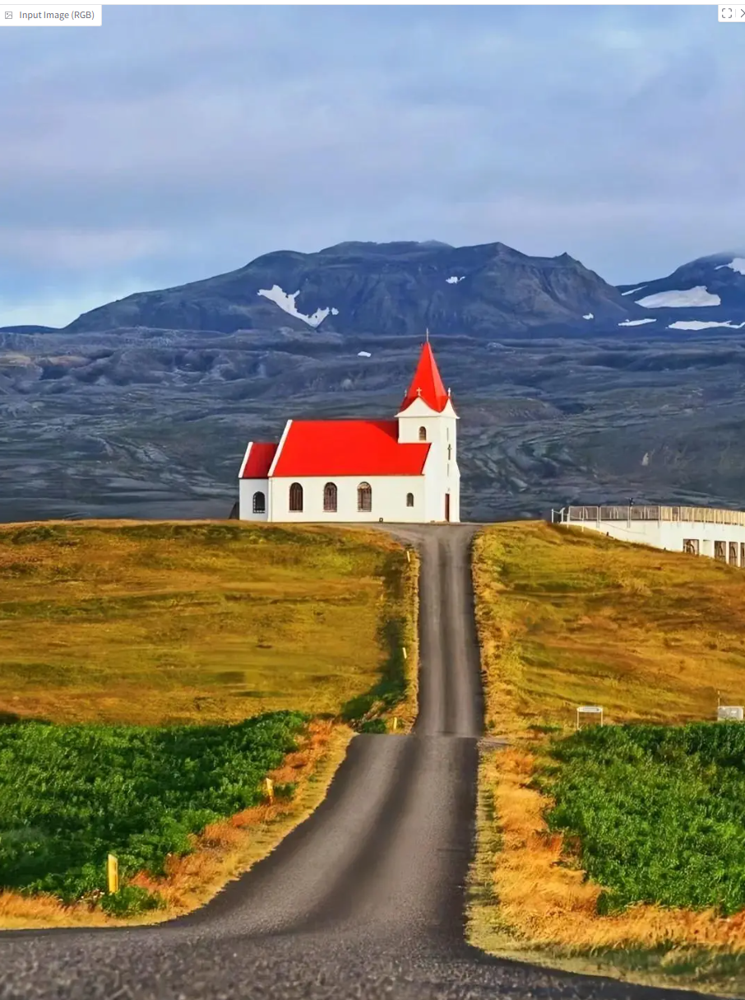

---

## Stage 1 — Forward Warp (with holes)

Left Warp  
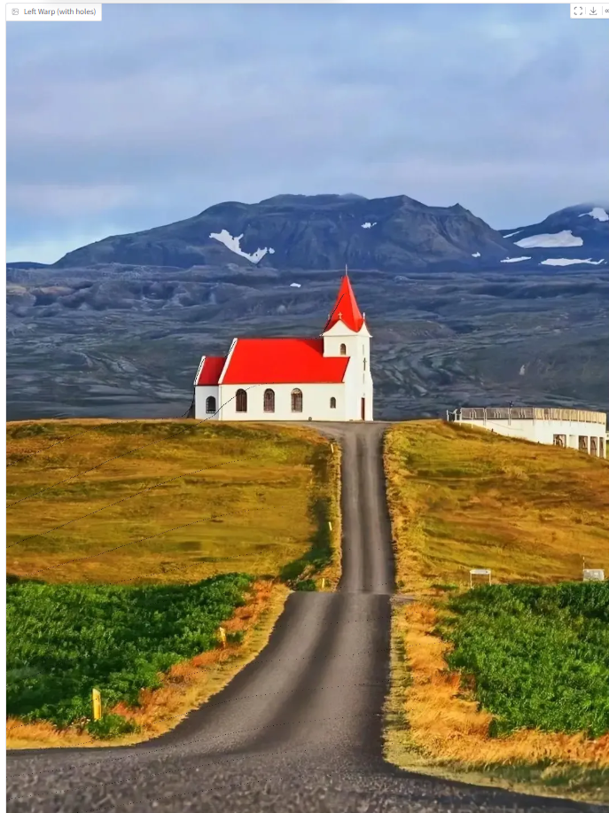

Right Warp  
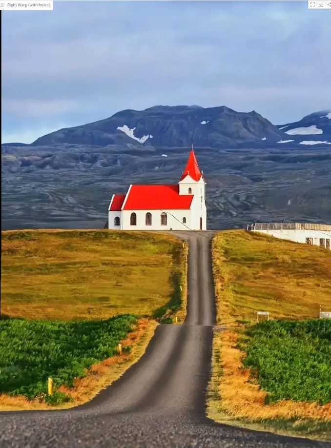

---

## Stage 2 — Hole Masks

Left Mask  
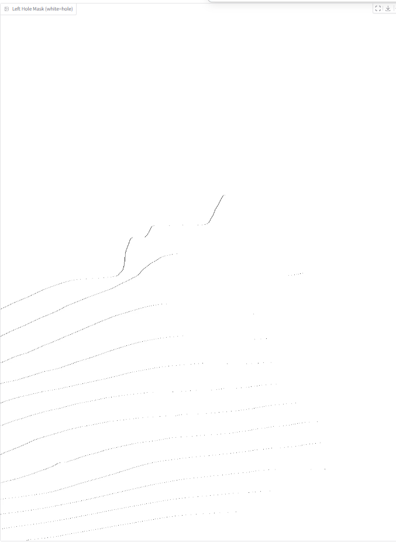

Right Mask  
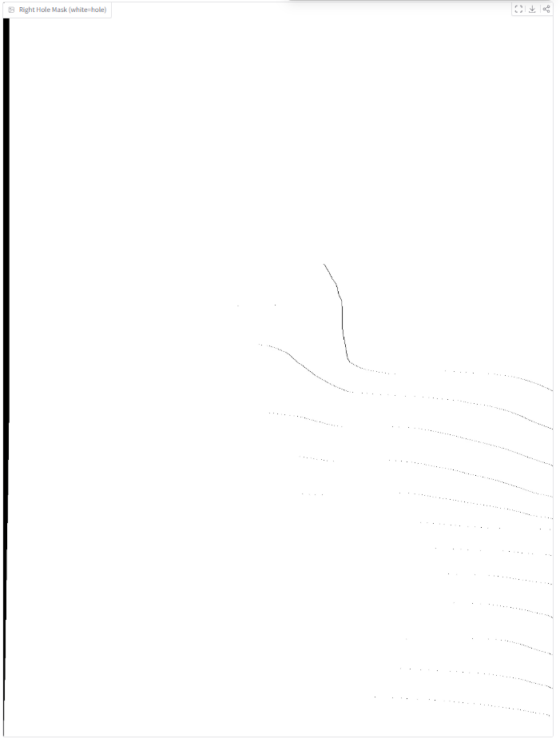

---

## Stage 3 — Inpaint Filled Stereo

Left Filled  
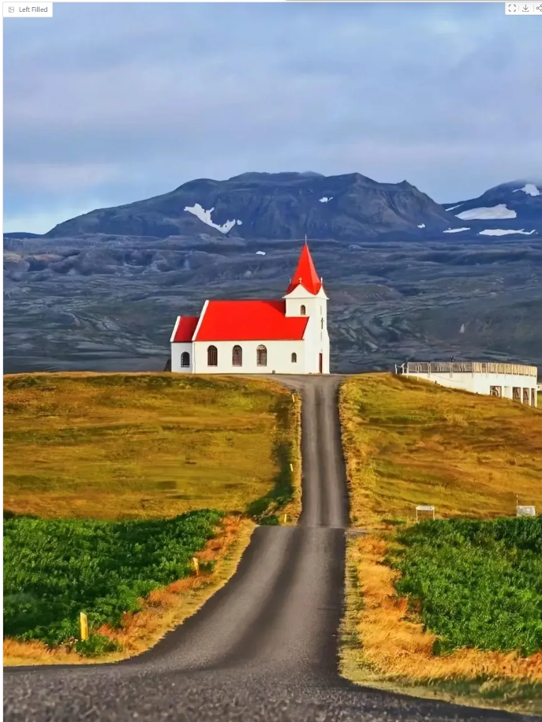

Right Filled  
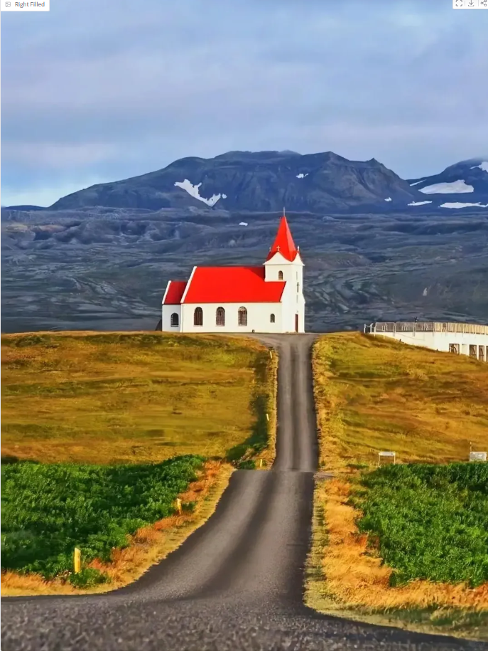

---

## Stage 4 — Diffusion Restoration (Left / Right)

Left Restored  
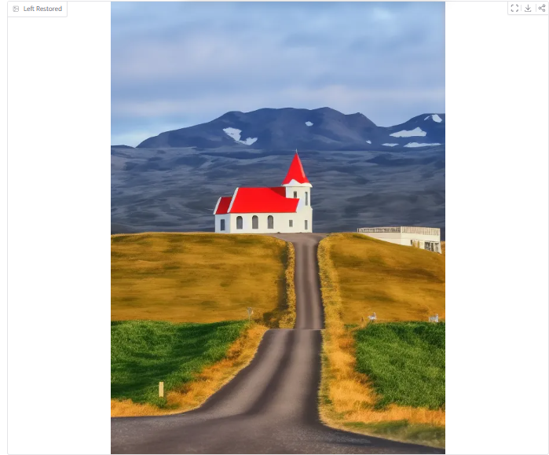

Right Restored  
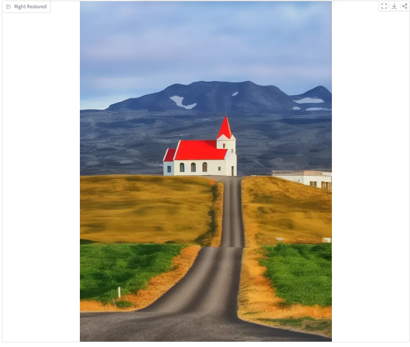

---

## Stage 5 — Stereo Outputs

### Side-by-Side (Before Diffusion)

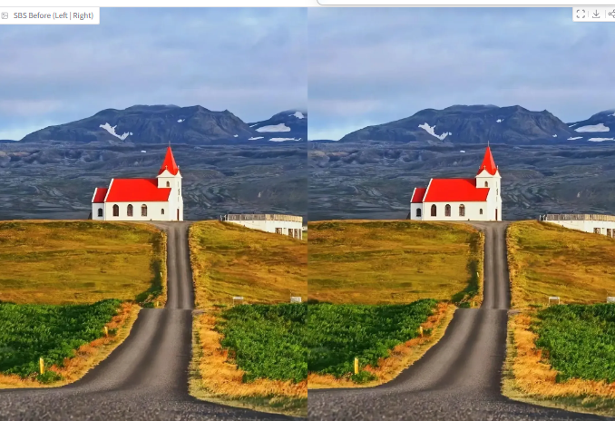

### Side-by-Side (After Diffusion)

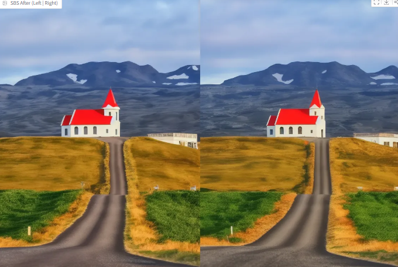

---

### Red-Cyan Anaglyph (Before Diffusion)

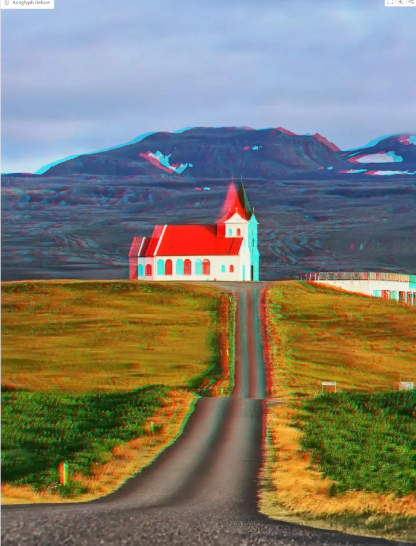

### Red-Cyan Anaglyph (After Diffusion)

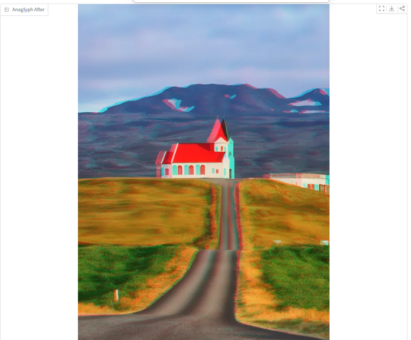

---

## Stage 6 — Depth & Disparity Visualization

Depth Map  
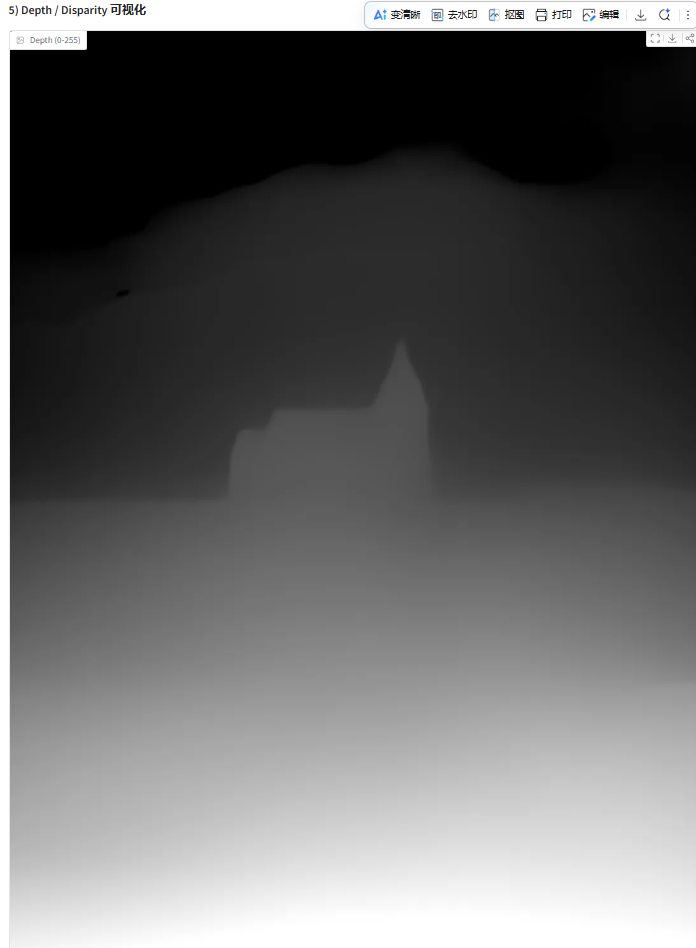

Disparity Map  
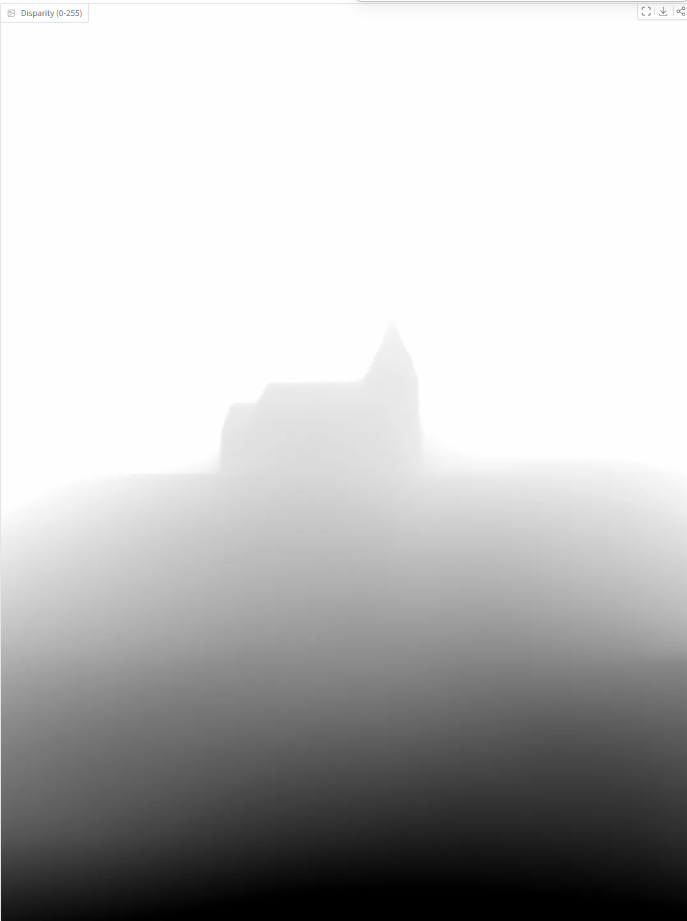

---

# 🧪 Normal DIBR Version (Without Diffusion)

## Input


---

## Forward Warp

Left Warp  


Right Warp  


---

## Filled Stereo

Left Filled  


Right Filled  


---

## Stereo Outputs

Side-by-Side  


Red-Cyan Anaglyph  


---

## 🛠 Installation

Tested on Windows + Conda + Python 3.10

```bash
pip install torch torchvision
pip install diffusers transformers accelerate safetensors
pip install opencv-python pillow gradio
